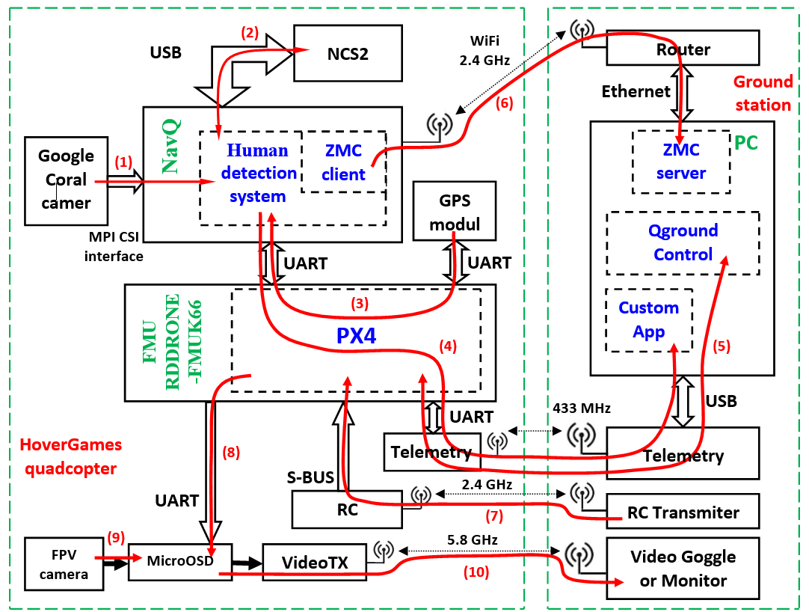
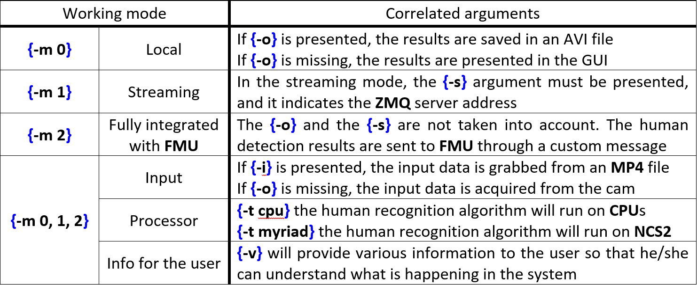

# NXP HoverGames Challenge 2: Help Drones, Help Others During Pandemics

These are the codes developed in the frame of NXP HoverGames Challenge 2: Help Drones, Help Others During Pandemics competition 

## Videos
- [Human detection - 1 subject (github)](https://github.com/dmdobrea/HoverGames_Challenge2/blob/main/05_RealApplication_NavQ/output/v1_rez.avi)
- [Human detection - 3 subjects (github)](https://github.com/dmdobrea/HoverGames_Challenge2/blob/main/05_RealApplication_NavQ/output/v2_rez.avi)
- [Human detection - in real-time (YouTube)](https://youtu.be/pCcItZNOWmc)

## Overview

In this project, I propose a solution to sustain and enforce the quarantine zones. The solution is based on an autonomous unmanned aerial vehicle (a NXPHoverGames drone) to detect humans and timely send warnings to a control center.

## Components

### Hardware components:

- 1 x **NXP KIT-HGDRONEK66** (carbon frame kit, BLDC motors, ESCs, PDB, propellers, etc.)
- 1 x **NXP RDDRONE-FMUK66** - flight management unit
- 1 x **NXP RDDRONE-8MMNavQ** - an embedded computer (i.MX 8M Mini Quad, 2GB LPDDR4, 16GB eMMC, WiFi/BT)
- 1 x **Google Coral camera**
- 1 x **NXP HGD-TELEM433** - 433Mhz Telemetry Radio 
- 1 x 4S 5000 mAh battery (3S can work too)

### Software components

#### Official support software

- **PX4** - an open source flight control software for drones and other unmanned vehicles
- **PX4 MAVSDK** - a package used to control NXPHoverGames using MAVLink
- **PX4 QGroundControl** - Ground Control Station for the MAVLink protocol
- **NXP MCUXpresso IDE** - Eclipse-based IDE tool used to develop applications on NXP RDDRONE-FMUK66

#### Main software components developed for NXP HoverGames Challenge 2

- **hr_RealAppNavQ.py** (placed in 05_RealApplication_NavQ) - a human recognition application (running on **RDDRONE-8MMNavQ** embedded system ) developed in Python based on MobileNet-SSD (MobileNet Single-Shot multibox Detection) deep neural network and on a correlation tracker algorithm
- **server_jpg.py** (placed in 03_ZMQ_base) - ZeroMQ server (running on the ground station PC) able to talk with **hr_RealAppNavQ.py** (placed in working mode 1: "-m 1").
- **uorb_mavlink** (placed in 06_FMUK66/test_commCompCom) - the application running on the **RDDRONE-FMUK66 FMU** able to receive custom **MAVlink** messages (sent it by **server_jpg.py** application placed in workinh mode 2: "-m 2") as **uORB** messages

## How to use the human detection application

All the functionalities of the main program (**[hr_RealAppNavQ.py](https://github.com/dmdobrea/HoverGames_Challenge2/blob/main/05_RealApplication_NavQ/hr_RealAppNavQ.py)**) are activated through the different command line's arguments. For a short description of them see the folowing table:

Several examples of hr_RealAppNavQ.py use: 
1. For real operation on the **NXPHoverGames** drone: **hr_RealAppNavQ.py -m 2 -t cpu** or **hr_RealAppNavQ.py -m 2 -t myriad** - but only if **Neural Compute Stick 2** is present. Here the acquisition of position data (**GPS**) from **FMU** is made in a separate thread to minimize the detection algorithm's performance impact. 
2. For system performance analysis: **hr_RealAppNavQ.py -m 0 -t cpu -i videos/VideoTest2.mp4 -o output/VideoResults.avi**. In this situation, the human detection algorithm will run on the system's **CPU**s, using the VideoTest2.mp4 video, and the results will be saved to VideoResults.avi. Saving the data was done on a different process (different by the main process containing the detection algorithm), so detection performance will not be affected.  
3. Real-time human detection and streaming data: **hr_RealAppNavQ.py -m 1 -t cpu -s 192.168.100.100**. In this mode, the [Human detection - in real-time (YouTube)](https://youtu.be/pCcItZNOWmc) movie was done. The streaming is done on a new process.

## Other software applications from this repository

- All the applications from the folder **[01_Exemples_MAVSDK](https://github.com/dmdobrea/HoverGames_Challenge2/tree/main/01_Exemples_MAVSDK)** are not developed by myself. They are only used to prove the functionality of communication through **MAVSDK**. These applications have been configured to work with the **NXPHoverGames** drone via serial communication. If you want to learn how to use the **MAVSDK** to communicate from applications developed in C/C++ or Python (running on a companion computer) with a **PX4 FMU** unit, please **[follow the steps from this tutorial](https://www.hackster.io/mdobrea/c-and-python-interface-management-application-for-fmuk66-6dd935)**.
- All the applications from the folder **[02_commCustom](https://github.com/dmdobrea/HoverGames_Challenge2/tree/main/02_commCustom)** were developed for the companion computer – in my case **NavQ**. Going by the idea that simple components are easier to understand and test than a complex program:
1. the **[getGPS.py](https://github.com/dmdobrea/HoverGames_Challenge2/blob/main/02_commCustom/getGPS.py)** is used to get the **GPS** data from **FMU** using a **MAVLink** message – in the **[hr_RealAppNavQ.py](https://github.com/dmdobrea/HoverGames_Challenge2/blob/main/05_RealApplication_NavQ/hr_RealAppNavQ.py)** application is the section from line 33 up to 45. 
2. **[sendCustomMavlinkMSG.py](https://github.com/dmdobrea/HoverGames_Challenge2/blob/main/02_commCustom/sendCustomMavlinkMSG.py)** sends a custom **MAVLink message** (***video_monitor*** message) from the **NavQ** to the **FMU**. In the **[hr_RealAppNavQ.py](https://github.com/dmdobrea/HoverGames_Challenge2/blob/main/05_RealApplication_NavQ/hr_RealAppNavQ.py)** application, this code can be found in two sections (a) from line 209 up to 219 and (b) from 467 to 475.
- Part of the applications from **[02_commCustom](https://github.com/dmdobrea/HoverGames_Challenge2/tree/main/02_commCustom)** folder work in pair with the applications from the **[06_FMUK66](https://github.com/dmdobrea/HoverGames_Challenge2/tree/main/06_FMUK66)** folder. A communication between a companion computer (in my case NavQ - RDDRONE-8MMNavQ "NavQ") and an FMU unit (in my case, an RDDRONE-FMUK66) can be done in an exquisite mode through custom messages. A tutorial on this topic can be studied here: **[Communication through custom uORB and MAVLink messages](https://www.hackster.io/mdobrea/communication-through-custom-uorb-and-mavlink-messages-269ebf)**. 
- The **[sendCustomMavlinkMSG.py](https://github.com/dmdobrea/HoverGames_Challenge2/blob/main/02_commCustom/sendCustomMavlinkMSG.py)** sends a custom **MAVLink** ***video_monitor*** message from the **NavQ** to the **FMU**, where **[test_commCompCom](https://github.com/dmdobrea/HoverGames_Challenge2/tree/main/06_FMUK66/test_commCompCom)** application receives  it as **uORB** message.
- The **[inject_customUORBmsg](https://github.com/dmdobrea/HoverGames_Challenge2/tree/main/06_FMUK66/inject_customUORBmsg)** component running on the **FMUK66 FMU** sends a **uORB** message to the companion computer (**NavQ** embedded system) received by the **[receiveCustomMavlinkMSG.py](https://github.com/dmdobrea/HoverGames_Challenge2/blob/main/02_commCustom/receiveCustomMavlinkMSG.py)** application as **MAVLink** message.
- The **[03_ZMQ_base](https://github.com/dmdobrea/HoverGames_Challenge2/tree/main/03_ZMQ_base)** contains all main componets related with the **ZeroMQ** API. The client.py and server.py or client_jpg.py or server_jpg.py applications are the client-server pairs used in sending or receiving directly or compressed images from the client application (placed on the **NXPHoverGames** drone) to the server application (placed on the base station). 
- For example, the **[client_jpg.py](https://github.com/dmdobrea/HoverGames_Challenge2/blob/main/03_ZMQ_base/client_jpg.py)** application code is found in the **[sendCustomMavlinkMSG.py](https://github.com/dmdobrea/HoverGames_Challenge2/blob/main/02_commCustom/sendCustomMavlinkMSG.py)** application, especially in the ***stream_video*** process placed between lines 100 and 131. 

